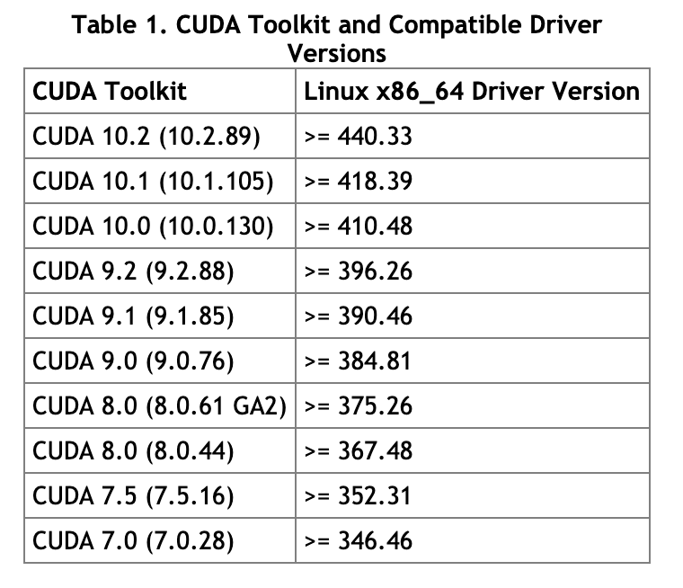

### Customize Tensorflow Docker (Diff Cuda)

The official tensorflow docker (>1.13) require cuda10. If the version of nvidia-dirver is old, it would be a high probability to have a compatibility error when running a official docker in the server.  

>-gpu tags are based on Nvidia CUDA. You need nvidia-docker to run them. NOTE: GPU versions of TensorFlow 1.13 and above (this includes the latest- tags) require an NVidia driver that supports CUDA 10. See NVidia's support matrix.

###### Nvida Concept
> 什么是CUDA
CUDA(ComputeUnified Device Architecture)，是显卡厂商NVIDIA推出的运算平台。 CUDA是一种由NVIDIA推出的通用并行计算架构，该架构使GPU能够解决复杂的计算问题。

> 什么是CUDNN
NVIDIA cuDNN是用于深度神经网络的GPU加速库。它强调性能、易用性和低内存开销。NVIDIA cuDNN可以集成到更高级别的机器学习框架中，如谷歌的Tensorflow、加州大学伯克利分校的流行caffe软件。简单的插入式设计可以让开发人员专注于设计和实现神经网络模型，而不是简单调整性能，同时还可以在GPU上实现高性能现代并行计算。

> CUDA与CUDNN的关系
CUDA看作是一个工作台，上面配有很多工具，如锤子、螺丝刀等。cuDNN是基于CUDA的深度学习GPU加速库，有了它才能在GPU上完成深度学习的计算。它就相当于工作的工具，比如它就是个扳手。但是CUDA这个工作台买来的时候，并没有送扳手。想要在CUDA上运行深度神经网络，就要安装cuDNN，就像你想要拧个螺帽就要把扳手买回来。这样才能使GPU进行深度神经网络的工作，工作速度相较CPU快很多。

> CUDNN不会对CUDA造成影响


###### Build Docker

1. Check dirver versions. To verify your cuda requirement with dirver version.
```
sudo nvidia-smi
```
<p align="center">
  </img>
</p>

2. Build up your own docker images with Dockfile.
  - Change nvidia/cuda (nvidia/cuda:9.0-base)
  [Check Dockerfile Here](documents/Dockerfile)
  - Build the images. Putting Dockerfile and bashrc in a new folder, then run the command as below.
  ```
  docker build -t cuda9-tf:v1 .
  ```
  - If the original pip source is slow or timeout frequently, change pip source in Dockerfile.
  ```
  pip install -i https://pypi.tuna.tsinghua.edu.cn/simple tensorflow
  ```

3. Preparing deployment.
  ```
  docker save -o xxx.tar imageId
  docker load -i xxx.tar
  docker tag imageId tf/tf:v1
  ```

4. If docker do not have a background runtime, and you still want to run long the container in background. To run the gpu docker need to add --runtime=nvidia (Docker-2) or nvidia-docker (Docker-1).
```
docker run --runtime=nvidia -ti -p 8888:8888 -p 8822:22 -v $PWD:/app --name=dockerName imageId
docker run --runtime=nvidia -d imageId top
```

##### References
- https://github.com/NVIDIA/nvidia-docker
- https://hub.docker.com/r/nvidia/cuda
- https://hub.docker.com/r/tensorflow/tensorflow
- https://docs.nvidia.com/deploy/cuda-compatibility/index.html#binary-compatibility__table-toolkit-driver
- https://www.jianshu.com/p/622f47f94784
- https://www.jianshu.com/p/dfbb90995a2c
